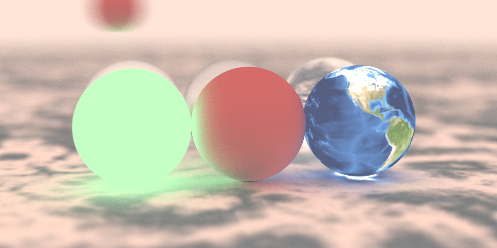

# raytracing_renderer_cuda
A C++ rendering framework using raytracing and based on cuda.

The project will be to turn the renderer into a backend server:\
1 - Writing the base cuda code for the necessary algebra (vector3d, basic shapes such as spheres, cubes and triangles)\
2 - Render a simple scene with no materials. The rendering result will be a jpeg or ppm image\
3 - Support texture projection.\
4 - Add more shapes and materials, (use basic materials, maybe support .mdl format in the future?)\
5 - Support loading .obj file types\
6 - Use a json file that describes the scene as input.
7 - A aws cloud based solution where the client draws a scene in a web browser (using THREE or webGL) and sends the json file to the server (aws ec2 that supports cuda)... maybe the server will be based on **asio**, and maybe use a REST API otherwise I will develop an API on my own.\
8 - ?? \
9 - Profit

## Current state
Now the renderer can generate procedural textures using perlin noise (wood, marble and turbulance) and use uv image textures that are currently stored in global memory (use texture memory in the future).\
Currently, I'm working on supporting more geometrical shapes (cubes, triangles) and basic transformation. This can be done by either using an existing .obj file loader, or writing my own.
### Last render
Balls! with emitter, dielectric, lambertian, image texture and metal materials with defocus and motion blur (1200x600 image size, 100 samples per pixel, render time 1661.50ms)

You can view previous renders under ./renders.
### Future Improvements
#### How the project is organized
For now, the render is one **.cu** file and multiple header files with multiple classes each so it's easier to compile and debug. Once I start developing the server part with asio, I will split every .h file into a **.cu** and **.cuh**.
#### A faster BVH
Currently bvh is called by each thread, and does an initial iterative dfs if the ray hits its initial bounding box (using global memory). Since bounding boxes are read-only, can be computed before starting the main rendering kernel and memory access is localized (it's a dfs), It would be better to use read-only texture memory in the future.
#### An interactive GUI with Qt
Currently the binary only generates an image render for a hardcoded scene. This can be improved to rendering an image to a GUI interface where the user can interact by rotating, moving and zooming.

## Requirements
**NVIDIA CUDA toolkit** and a CUDA-capable device are required to build and run the renderer.
### NVIDIA CUDA toolkit
This highly depends on your host machine. Go to https://developer.nvidia.com/cuda-downloads and download the appropriate SDK version.\
After installing, check if nvcc is available by running the following command:
```sh
nvcc --version
```
This should print something like the following:
```
nvcc: NVIDIA (R) Cuda compiler driver
Copyright (c) 2005-2019 NVIDIA Corporation
Built on Sun_Jul_28_19:07:16_PDT_2019
Cuda compilation tools, release 10.1, V10.1.243
```
Also, check if a NVIDIA GPU device is available on your host machine by running the following:
```
Sun Nov 15 23:48:19 2020       
+-----------------------------------------------------------------------------+
| NVIDIA-SMI 455.32.00    Driver Version: 418.67       CUDA Version: 10.1     |
|-------------------------------+----------------------+----------------------+
| GPU  Name        Persistence-M| Bus-Id        Disp.A | Volatile Uncorr. ECC |
| Fan  Temp  Perf  Pwr:Usage/Cap|         Memory-Usage | GPU-Util  Compute M. |
|                               |                      |               MIG M. |
|===============================+======================+======================|
|   0  Tesla T4            Off  | 00000000:00:04.0 Off |                    0 |
| N/A   38C    P8     9W /  70W |      0MiB / 15079MiB |      0%      Default |
|                               |                      |                 ERR! |
+-------------------------------+----------------------+----------------------+
                                                                               
+-----------------------------------------------------------------------------+
| Processes:                                                                  |
|  GPU   GI   CI        PID   Type   Process name                  GPU Memory |
|        ID   ID                                                   Usage      |
|=============================================================================|
|  No running processes found                                                 |
+-----------------------------------------------------------------------------+
```

## How to run
```sh
git clone git clone https://github.com/slimem/raytracing_renderer_cuda.git
cd raytracing_renderer_cuda
make all
```
The raytracer generates a ```render.jpg``` images.\
To profile the renderer, run the following:
```sh
make profile
```
or
```sh
profile_metrics
```

#
The first part of this project is inspired by [this book serie by Peter Shirley](https://github.com/RayTracing/raytracing.github.io).\
Enjoy this little project as you see fit, and feel free to contact me!\
Email: slimlimem@gmail.com Linkedin: https://www.linkedin.com/in/slim-limem/
