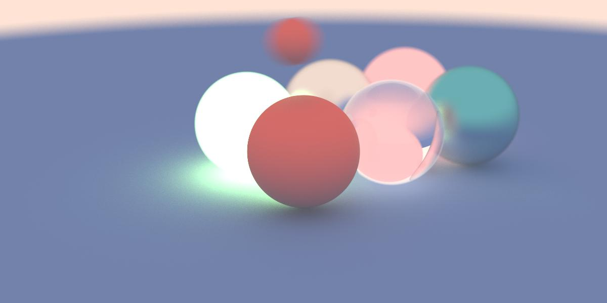

# raytracing_renderer_cuda
A C++ rendering framework using raytracing and based on cuda  (WIP)

The project will be split into the following steps:\
1 - Writing the base cuda code for the necessary algebra (vector3d, basic shapes such as spheres and cubes)\
2 - Render a simple scene with no materials. The rendering result will be a jpeg or ppm image\
3 - Add more shapes and materials, (use basic materials, maybe support .mdl format in the future?)\
4 - Maybe support loading mdl (vertex and materials) (the objective is to support all mdl materials)\
5 - A aws cloud based solution where the client draws a scene in a web browser (using webGL) and sends a json file that descripes the scene (rest api) to a server (aws ec2 that supports cuda)... maybe the server will be based on **asio**\
5 - ?? \
6 - Profit

## Current state
Balls! emitter, dielectric, lambertian and metal materials with defocus and motion blur (1200x600 image size, 500 samples per pixel, render time 7300.2ms)


## Requirements
**NVIDIA CUDA toolkit** and **netpbm** are required to run the renderer.
### NVIDIA CUDA toolkit
This highly depends on your host machine. Go to https://developer.nvidia.com/cuda-downloads and download the appropriate SDK version.\
After installing, check if nvcc is available by running the following command:
```sh
nvcc --version
```
This should print something like the following:
```
nvcc: NVIDIA (R) Cuda compiler driver
Copyright (c) 2005-2019 NVIDIA Corporation
Built on Sun_Jul_28_19:07:16_PDT_2019
Cuda compilation tools, release 10.1, V10.1.243
```
Also, check if a NVIDIA GPU device is available on your host machine by running the following:
```
Sun Nov 15 23:48:19 2020       
+-----------------------------------------------------------------------------+
| NVIDIA-SMI 455.32.00    Driver Version: 418.67       CUDA Version: 10.1     |
|-------------------------------+----------------------+----------------------+
| GPU  Name        Persistence-M| Bus-Id        Disp.A | Volatile Uncorr. ECC |
| Fan  Temp  Perf  Pwr:Usage/Cap|         Memory-Usage | GPU-Util  Compute M. |
|                               |                      |               MIG M. |
|===============================+======================+======================|
|   0  Tesla T4            Off  | 00000000:00:04.0 Off |                    0 |
| N/A   38C    P8     9W /  70W |      0MiB / 15079MiB |      0%      Default |
|                               |                      |                 ERR! |
+-------------------------------+----------------------+----------------------+
                                                                               
+-----------------------------------------------------------------------------+
| Processes:                                                                  |
|  GPU   GI   CI        PID   Type   Process name                  GPU Memory |
|        ID   ID                                                   Usage      |
|=============================================================================|
|  No running processes found                                                 |
+-----------------------------------------------------------------------------+
```
### Netpbm
For now, **netpbm** is required since the render generates a .ppm image that needs to be converted to jpg or bmp. In the future, the renderer will generate in jpg, png and bmp formats.
```sh
apt-get install netpbm
```
## How to run
```sh
git clone git clone https://github.com/slimem/raytracing_renderer_cuda.git
cd raytracing_renderer_cuda
make all
```
The raytracer generates two images, a ```render.ppm``` and ```render.jpg``` images.\
To profile the renderer, run the following:
```sh
make profile
```
or
```sh
profile_metrics
```

#
Enjoy this little project as you see fit, and feel free to contact me!\
Email: slimlimem@gmail.com Linkedin: https://www.linkedin.com/in/slim-limem/
